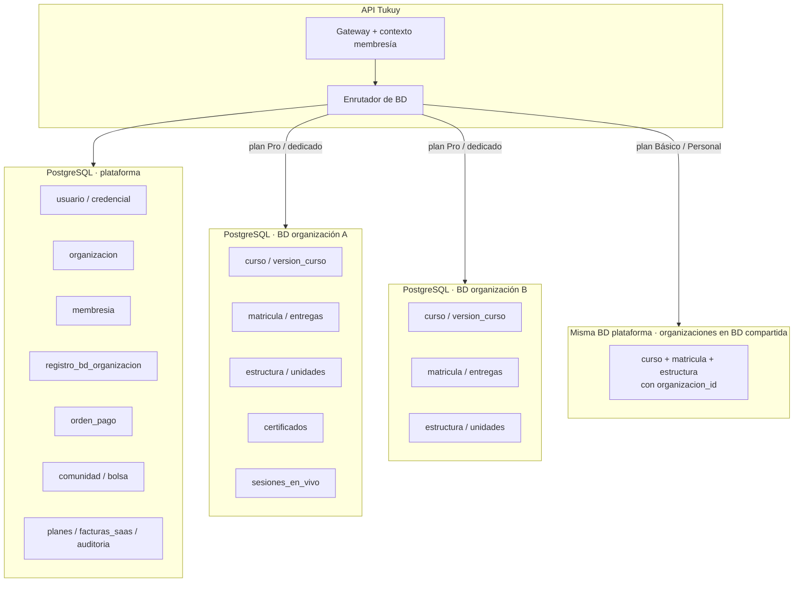
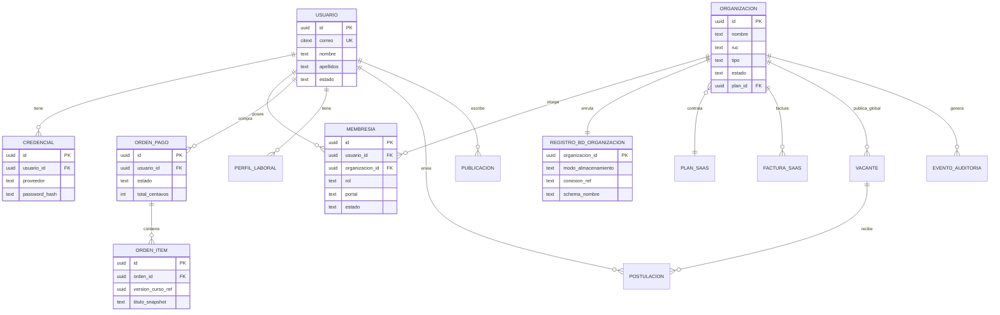
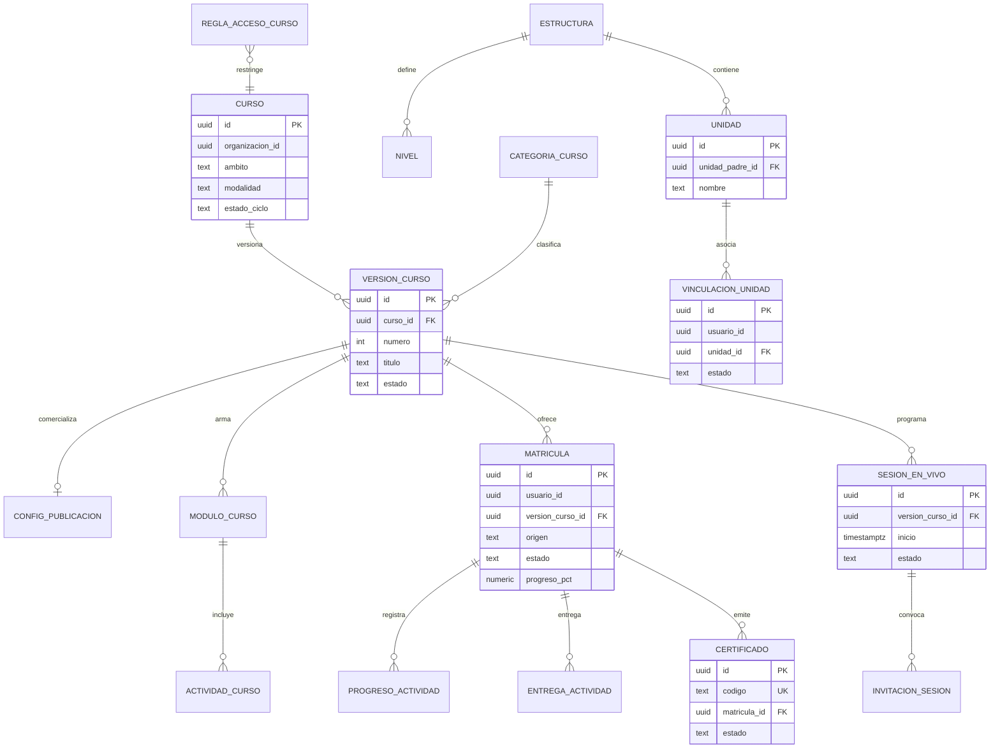
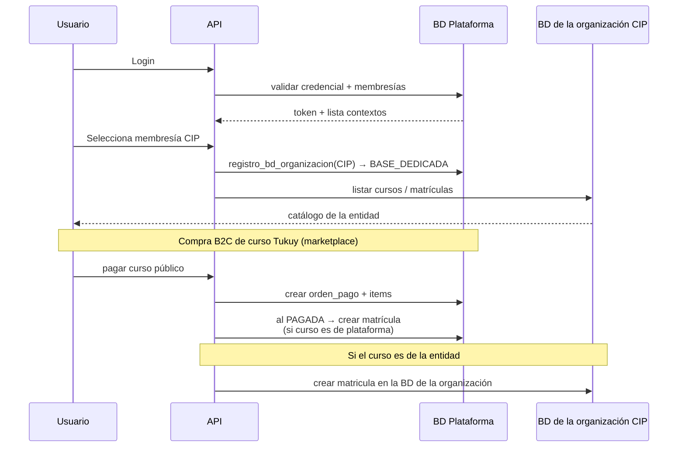

# Diagrama BD multi-organización — una BD distinta por entidad (híbrido)

> Complementa el índice [`ARQUITECTURA-BD.md`](./ARQUITECTURA-BD.md) y los dominios en [`bd/`](./bd/).  
> No redefine tablas: indica **dónde** vive cada dominio físicamente.

## Qué planteo

Sí conviene **aislar datos por organización**, pero **no** crear una base completa para cada colegio/empresa desde el día 1. Lo óptimo para Tukuy es un **modelo híbrido**:

| Capa | Qué guarda | Docs de dominio |
|---|---|---|
| **BD Plataforma** | Identidad, membresías, pagos B2C, comunidad, bolsa, SaaS | [01](./bd/01-plataforma-identidad-pagos.md), [05](./bd/05-comunidad-bolsa.md) |
| **BD / schema de la organización** | Estructura, cursos, matrículas, vivo, certificados | [02](./bd/02-organizacion-estructura-permisos.md), [03](./bd/03-catalogo-aprendizaje.md), [04](./bd/04-vivo-certificados.md) |
| **Personal / Básica** | Mismo ER de la organización, filas compartidas | Todos, con `organizacion_id` |

```text
                    ┌─────────────────────────────┐
                    │     BD PLATAFORMA            │
                    │  docs 01 + 05 + registro_bd_organizacion│
                    └──────────────┬──────────────┘
                                   │
           ┌───────────────────────┼───────────────────────┐
           ▼                       ▼                       ▼
   ┌───────────────┐      ┌───────────────┐      ┌───────────────┐
   │ BD org. CIP    │      │ BD org. Andina │      │ Compartido    │
   │ docs 02–04    │      │ docs 02–04    │      │ orgs pequeñas │
   └───────────────┘      └───────────────┘      └───────────────┘
```

---

## 1. Topología (diagrama de despliegue)



---

## 2. Tabla de enrutamiento (en BD plataforma)

```sql
-- Vive SOLO en plataforma. Decide a qué BD/schema va cada organización.
CREATE TABLE registro_bd_organizacion (
  organizacion_id   uuid PRIMARY KEY REFERENCES organizacion(id),
  modo_almacenamiento text NOT NULL
    CHECK (modo_almacenamiento IN ('COMPARTIDO', 'SCHEMA', 'BASE_DEDICADA')),
  -- COMPARTIDO: tablas en plataforma con organizacion_id
  -- SCHEMA:     schema PostgreSQL org_<slug> en el mismo cluster
  -- BASE_DEDICADA: otra instancia / otra database name
  conexion_ref      text,          -- nombre BD, DSN logical name, o schema
  schema_nombre     text,          -- ej. org_cip_cusco
  region            text DEFAULT 'pe-lima',
  estado            text NOT NULL DEFAULT 'ACTIVO',
  migrado_en        timestamptz,
  creado_en         timestamptz NOT NULL DEFAULT now()
);
```

Flujo al atender un request:

1. Auth → `usuario_id`
2. Header `X-Tukuy-Membresia-Id` → `membresia` → `organizacion_id`
3. `registro_bd_organizacion` → abrir pool/conexión de la organización (o usar plataforma si `COMPARTIDO`)
4. Ejecutar queries de catálogo/aprendizaje/estructura **solo** en ese store

---

## 3. Diagrama ER — BD Plataforma (compartida)



**Qué NO va en plataforma (si la organización es dedicado):** matrículas masivas, entregas PDF, estructura de unidades, sesiones Meet, certificados emitidos por la entidad.

**Qué SÍ puede quedar referenciado desde plataforma:** `version_curso_ref` (UUID) en `orden_item` aunque el contenido vivo del curso esté en la organización — la orden guarda snapshot de precio/título.

---

## 4. Diagrama ER — BD de la organización (por entidad)

Cada BD/schema de entidad tiene **el mismo modelo**. Solo cambian los datos.



Notas:

- `usuario_id` en la organización es **solo referencia** al UUID de plataforma (sin FK cross-database). La integridad se valida en aplicación.
- `organizacion_id` en tablas de la organización = constante de esa BD (redundante pero útil al migrar o fusionar).

---

## 5. Comparación de estrategias

| Estrategia | Pros | Contras | Cuándo usarla |
|---|---|---|---|
| **A. Una sola BD + `organizacion_id` + RLS** | Simple, joins fáciles, barato | Menos aislamiento; “noisy neighbor” | MVP y orgs pequeñas (Personal, Básica) |
| **B. Schema por entidad** (mismo cluster PG) | Aislamiento lógico, un backup cluster, migraciones por schema | Límite de schemas; ops media | Orgs medianas / plan Pro |
| **C. BD dedicada por entidad** | Máximo aislamiento, backup/restore por cliente, compliance | Coste, migraciones N veces, sin joins entre organizaciones | Colegios/empresas grandes, contratos enterprise |
| **D. Híbrido (recomendado)** | Escala con el negocio; plataforma unificada | Router + disciplina de contratos | Tukuy en producción |

### Recomendación concreta

```text
Plan Personal / Docente independiente  → COMPARTIDO (plataforma)
Plan Empresa Básica                    → COMPARTIDO (plataforma)
Plan Empresa Pro                       → SCHEMA  (mismo cluster)
Plan Enterprise / Colegio grande       → BASE_DEDICADA
```

El **mismo diagrama ER de la organización** aplica en A, B y C; solo cambia *dónde* vive.

---

## 6. Diagrama de flujo de un curso entre capas



---

## 7. Diagrama simplificado “qué va dónde”

```mermaid
flowchart LR
  subgraph SIEMPRE_PLATAFORMA["Siempre en plataforma"]
    A1[usuario]
    A2[membresia]
    A3[organizacion]
    A4[registro_bd_organizacion]
    A5[orden_pago]
    A6[comunidad]
    A7[bolsa global]
    A8[facturacion SaaS]
  end

  subgraph SIEMPRE_ORG["Siempre en store de la entidad"]
    B1[estructura / unidades]
    B2[cursos y versiones de la org]
    B3[matriculas internas]
    B4[entregas / calificaciones]
    B5[sesiones en vivo]
    B6[certificados emitidos]
    B7[reglas de acceso]
  end

  SIEMPRE_PLATAFORMA -.->|UUID usuario / org| SIEMPRE_ORG
```



---

## 8. Modelo mental para el equipo

1. **Persona** = una fila en plataforma (un login).
2. **Entidad** = una `organizacion` + un `registro_bd_organizacion` que dice *dónde* viven sus datos operativos.
3. **Membresía** = puente persona↔entidad (y portal/rol).
4. **Curso de entidad** = vive en el datos de la organización; **curso marketplace Tukuy** puede vivir en plataforma o en una organización “Tukuy Academy”.
5. **No hay joins SQL entre BDs**: la API orquesta; se sincronizan IDs UUID.

---

## 9. Relación con el resto de la documentación

Los **modelos por dominio** están en:

| Doc | Contenido |
|---|---|
| [`ARQUITECTURA-BD.md`](./ARQUITECTURA-BD.md) | Índice |
| [`bd/01-…`](./bd/01-plataforma-identidad-pagos.md) | Login, pagos, SaaS |
| [`bd/02-…`](./bd/02-organizacion-estructura-permisos.md) | Org interna + permisos |
| [`bd/03-…`](./bd/03-catalogo-aprendizaje.md) | Cursos / matrículas |
| [`bd/04-…`](./bd/04-vivo-certificados.md) | Vivo / certificados |
| [`bd/05-…`](./bd/05-comunidad-bolsa.md) | Comunidad / bolsa |

Este archivo define **cómo se parten físicamente** esas tablas entre plataforma y BD de cada organización (diagramas DBML separados).

| Diagrama | Archivo |
|---|---|
| BD plataforma | [`bd/tukuy-plataforma.dbml`](./bd/tukuy-plataforma.dbml) |
| BD por organización (plantilla) | [`bd/tukuy-bd-organizacion.dbml`](./bd/tukuy-bd-organizacion.dbml) |

Orden sugerido de implementación:

1. Empezar todo en **COMPARTIDO** (misma BD, `organizacion_id`, RLS).
2. Introducir `registro_bd_organizacion` con modo `COMPARTIDO` para todas.
3. Graduar clientes Pro a `SCHEMA` sin cambiar el código de dominio (solo el router).
4. Enterprise → `BASE_DEDICADA` con el mismo schema SQL de la organización.
